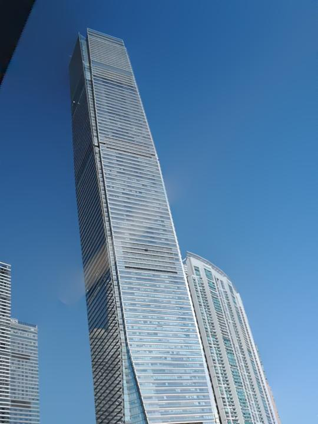

# HDR_and_ReflectionSuppress_with_Osmosis_Filtering
This repository contains a Matlab implementation of using the osmosis filtering algorithm for applications include multi-exposure fusion and reflection suppression.

The osmosis filtering is a gradient-based method, which is similar but different to Poisson editing and can sometimes be its alternative. The details of the algorithm can refer to the references in [this page](https://github.com/b03901165Shih/Osmosis_Filtering_using_ADI_and_OS).

In this project, we use the osmosis filtering for two problems that was originally formulated as Poisson equations to show the applicability of the osmosis algorithm as an alternative to Poisson solvers. We use gradient descent (Adam optimizer) to solve the variational energy from the osmosis model described in [[3]](#3).


## Multi-Exposure Fusion (MEF)

The code for MEF are contained in folder *Osmosis_multi-exposure-fusion/*. Run a demo by typing:

```
osmosisFusion.m
```

The algorithm is based on [[1]](#1) with some modifications. A brief introduction of our method can be found in [this slide](./Osmosis_multi-exposure-fusion/HDR_fusion_algotihm.pptx). The gradient of the osmosis energy is listed in Eq. (14) in [[3]](#3). 

> ### Results

[Dataset Source](https://ece.uwaterloo.ca/~k29ma/) | [Code Reference](https://github.com/sujoyp/gradient-domain-imagefusion)

<p align="left">
  
  
  
</p>

<p align="left">
  
  
  
</p>

<p align="left">
  
  
  
  
</p>


## Reflection Suppression

The code for MEF are contained in folder *Osmosis_reflectionSuppresion/*. Run a demo by typing:

```
osmosis_reflectionSuppress.m
```

The algorithm is based on [[2]](#2) ([Github link](https://github.com/yyhz76/reflectSuppress)). The reflection is suppressed by hard-thresholding small gradient value to 0 in the gradient map, and recover the image by solving a 2D Poisson's equation using DCT. We implement a similar version with the osmosis model. The energy is minimized by gradient descent.

> ### Results

Input image | Result (reflection suppressed)

<p align="left">
  
  
</p>

<p align="left">
  
  
</p>

<p align="left">
  
  
</p>

## References

<a id="1">[1]</a> Paul, Sujoy, Ioana S. Sevcenco, and Panajotis Agathoklis. "Multi-exposure and multi-focus image fusion in gradient domain." Journal of Circuits, Systems and Computers 25.10 (2016).

<a id="2">[2]</a> Yang, Yang, et al. "Fast single image reflection suppression via convex optimization." Proceedings of the IEEE Conference on Computer Vision and Pattern Recognition. 2019.

<a id="3">[3]</a> Parisotto, Simone, et al. "Variational Osmosis for Non-linear Image Fusion." IEEE Transactions on Image Processing 29 (2020): 5507-5516.
